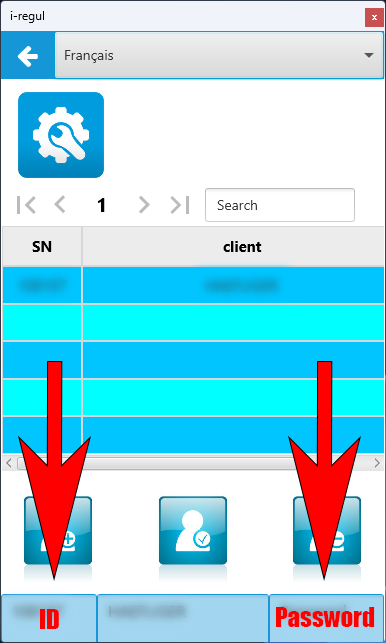

<a href="https://paypal.me/redpaladin191145"></a>

# Home Assistant support for heat pumps managed by i-regul.fr

## Introduction

This project is a custom integration of the heat pumps managed by the cloud based i-regul.fr into Home Assistant. This is based on my research of retro engineering on the application [i-regul connect](https://i-regul.com) made for Android and Windows and the head pump model `Mistral Compact 7` provided by the swiss company [SAPAC](https://sapac.ch).

## Disclaimer

I have no affiliation at all with `i-regul` nor `SAPAC`. It may stop working at any moment if i-regul decides to changes their communication protocol or SAPAC decides to use an other software or makes an update. This has been tested on my personnal appliance so I suppose that this may work also on other heat pumps working with i-regul but without guarranty.

So, as usual, *use this custom integration at your own risk !*

## Features

This is not a exhaustive reimplementation of `i-regul connect` into Home Assistant. In the actual version, I have focused on collecting data from the heat pump instead of controlling it but it may involve in the future.

### Entities available

* ♨️ Sensors to get external temperature, detailed energy consumptions, boiler temperature, ...
* 🌡️ Binary sensors to know when the hot water is warming, when the heatpump producing heat, ...


## Prerequisite

* This integrations has been developped and tested on [Home Assistant](https://home-assistant.io) version `2024.3.1` but it may surely works on more recent versions. Older versions support is not guaranteed.

* You need your ```id``` (or serial number) and ```password``` that you use to access to your heat pump from i-regul connect. The ```client_id``` is not needed. To do so, click on the upper part to open the list of appliance. Click on the item of the list and get the two info that you will need later on.



## Installation of the custom component

* I strongly suggest to use [HACS](https://hacs.xyz) to install this custom integrations in a easy way.

* You can also proceed to the installation manually. Copy the folder ```custom_components``` with its content into the ```config``` subfolder of your Home Assistant directory. By default, this directory is located under ```<HOME_ASSISTANT_FOLDER>/config```. The structure of the ```custom_components``` directory should look like this:

```
- i_regul_heatpump
    - __init__.py
    - api.py
    - binary_sensor.py
    - const.py
    - sensor.py
    - ...
```

* Add the new platform in your ```configuration.yaml```:

```
i_regul_heatpump:
  id: "<id>"
  password: "<password>"
  scan_interval: <optional polling interval in seconds. default 300>
```

* Restart Home Assistant.
Done! If you follow all the instructions, the data will be automatically fetched from i-regul cloud during startup. All entities in Home Assistant (i_regul_heatpump.*) are available and can be used for automation.

## Debugging
Some useful debug logs are generated to understand what's going on but not visible by default. To enable it, edit the file ```configuration.yaml```:

```
logger:
  default: info
  logs:
    i_regul_heatpump: debug
```